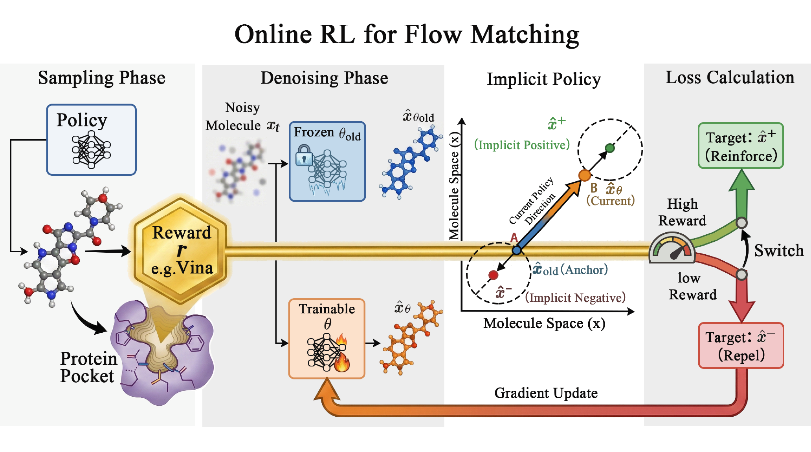

# MolFORM: Multi-modal Flow Matching for Structure-Based Drug Design

[](https://github.com/huang3170/MolForm/blob/main/LICENSE)

This repository is the official implementation of **MolFORM** ([arXiv:2507.05503](https://arxiv.org/abs/2507.05503)), a multi-modal flow-matching diffusion framework for structure-based molecular generation.

<p align="center">
  
</p>

---
## Performance Comparison on CrossDocked2020

| Model       | Vina Score ↓ | Vina Min ↓ | Vina Dock ↓ | Diversity ↑ | QED ↑    | SA ↑     |
|-------------|--------------|------------|-------------|-------------|----------|----------|
| TargetDiff  | -5.71        | -6.43      | -7.41       | 0.72        | 0.49     | 0.60     |
| MolCraft    | -6.15        | -6.99      | -7.79       | 0.72        | 0.48     | 0.66     |
| Alidiff     | -7.07        | -8.09      | -8.90       | 0.73        | 0.50     | 0.56     |
| MolJO       | -7.52        | -8.33      | -9.05       | 0.66        | **0.56** | **0.77** |
| MolFORM-RL  | **-7.60**    | **-8.37**  | **-9.24**   | **0.75**    | 0.50     | 0.68     |

---

## Project Overview

MolFORM supports three training modes:

1. **Standard Training**
   - Base diffusion / flow-matching training.
2. **DPO Training**
   - Offline preference optimization with ranked molecular pairs.
3. **NFT-Vina-SA Training**
   - Online RL-style fine-tuning with docking (Vina) + synthetic accessibility (SA) reward.

> NFT-Vina-SA is designed as **fine-tuning** from a base checkpoint.
> Use `configs/training_nft_vina_sa.yml`, load a pretrained model, and do **not** restore optimizer state.

---

## Environment Setup

Use the provided conda environment file:

```bash
conda env create -f env.yaml
conda activate MolFORM
```

For cluster scripts in `script_run/`, you can override environment selection:

```bash
export CONDA_ENV=MolFORM
```

---

## Data Preparation

- Base data reference: [TargetDiff](https://github.com/guanjq/targetdiff)
- DPO data reference: [AliDiff](https://github.com/MinkaiXu/AliDiff)

### NFT-Vina-SA specific preprocessing

NFT-Vina-SA uses the same LMDB/split as standard training, plus receptor files for docking reward.

1. `train.nft.reward.protein_root` (default `./data/crossdocked_v1.1_rmsd1.0_pocket10_pdb`) must contain protein PDB files aligned with dataset filenames.
2. Reward code resolves protein files using:
   - `protein_root / data.protein_filename` (primary), or
   - `protein_root / dirname(ligand_filename) / basename(ligand_filename)[:10] + ".pdb"` (fallback).
3. `train.nft.reward.tmp_dir` (default `./tmp_vina`) must be writable.
4. `protein_root` should also be writable, because Vina preprocessing may generate cached `*.pqr` and `*.pdbqt` files next to receptor PDBs.

Quick sanity check before NFT training:

```bash
test -d ./data/crossdocked_v1.1_rmsd1.0_pocket10
test -f ./data/crossdocked_pocket10_pose_split.pt
test -d ./data/crossdocked_v1.1_rmsd1.0_pocket10_pdb
mkdir -p ./tmp_vina
```

---

## Checkpoints

Default local checkpoint directory:

```text
./ckpt/
  molform_base_model.pt
  molform_dpo_model.pt
```

Pretrained checkpoints and sampling outputs are available on Google Drive:

- [Google Drive (checkpoints and sampling outputs)](https://drive.google.com/drive/folders/1B9ZFcNjdBFH5jyjmTM0nthV8B3q4t1--?usp=sharing)

Most scripts/configs now use local defaults and can be overridden with environment variables (for example `CKPT`, `LOGDIR`, `DPO_DATA`).

---

## Training

## 1) Standard Training

### Direct command

```bash
python -m scripts.train_diffusion configs/training_standard.yml \
  --tag standard_training \
  --name "Standard Training"
```

### Script

```bash
bash script_run/run_train_standard.sh
```

---

## 2) DPO Training

DPO uses a reference model (`model.ref_model_checkpoint`) and preference data (`--dpo_data`).

### Direct command

```bash
python -m scripts.train_diffusion configs/training_dpo.yml \
  --tag dpo_training \
  --dpo_data ./data/dpo_data/dpo_idx_sort_new.pkl \
  --name "DPO Training"
```

### Script

```bash
bash script_run/run_train_dpo.sh
```

---

## 3) NFT-Vina-SA Training

This mode performs online reward-guided fine-tuning.

- Config: `configs/training_nft_vina_sa.yml`
- Load base pretrained weights
- Skip optimizer/scheduler restore
- Optional: reset iteration counter to 1 (`--reset_iteration`)

### Direct command

```bash
python -m scripts.train_diffusion configs/training_nft_vina_sa.yml \
  --train_report_iter 10 \
  --tag nft_vina_sa \
  --logdir ./logs_diffusion \
  --name KDD-Molform-NFT-VinaSA \
  --checkpoint ./ckpt/molform_base_model.pt \
  --no_optimizer_state \
  --non_strict_load \
  --reset_iteration
```

### Script

```bash
bash script_run/run_train_nft_vina_sa.sh
```

---

## Sampling

Use the script entry point:

```bash
bash script_run/run_sample.sh
```

Sampling now prefers `data.path` and `data.split` from the runtime config.
You can also override them directly at runtime:

```bash
python -m scripts.sample_diffusion configs/sampling_kdd_confidence_49000.yml \
  --data_path ./data/crossdocked_v1.1_rmsd1.0_pocket10 \
  --split_path ./data/crossdocked_pocket10_pose_split.pt
```

Or through the shell wrapper:

```bash
DATA_PATH=./data/crossdocked_v1.1_rmsd1.0_pocket10 \
SPLIT_PATH=./data/crossdocked_pocket10_pose_split.pt \
bash script_run/run_sample.sh
```

---

## Evaluation

`RESULT_PATH` must be a sampling output directory that contains `result_*.pt` files.

Recommended script entry point:

```bash
RESULT_PATH=./outputs_sampling/sample_default \
bash script_run/run_eval.sh
```

Python entry point:

```bash
python -m scripts.evaluate_diffusion_multiprocess ./outputs_sampling/sample_default \
  --protein_root ./data/test_set \
  --docking_mode vina_score
```
